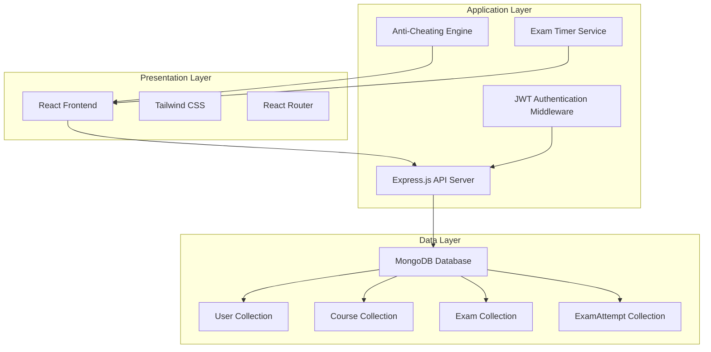
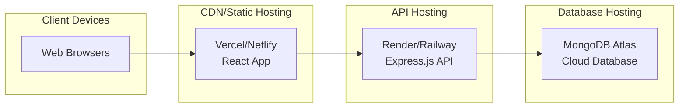
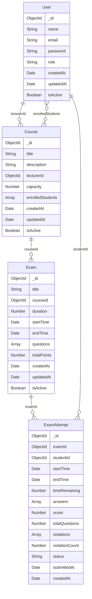

# ExamGuard Online Examination System - Design Document

## Overview

ExamGuard is a comprehensive web-based examination platform built on the MERN stack (MongoDB, Express.js, React.js, Node.js) that enables educational institutions to conduct secure online exams with robust anti-cheating measures. The system provides role-based access control for three user types: Admins who manage users, Lecturers who create courses and exams, and Students who register for courses and take exams.

The platform implements real-time browser-based anti-cheating detection using the Page Visibility API to monitor tab switching, along with copy-paste prevention and right-click disabling. A three-strike violation system automatically submits exams when cheating attempts exceed the threshold. The system features a timer-based exam engine with automatic submission, comprehensive results tracking, and violation reporting for academic integrity maintenance.

Key technical features include JWT-based authentication, bcrypt password encryption, MongoDB data persistence with referential integrity, RESTful API design, responsive React frontend with Tailwind CSS, and cloud deployment on free-tier services (MongoDB Atlas, Render/Railway, Vercel/Netlify).

## Architecture

### System Architecture Overview

The ExamGuard system follows a three-tier architecture pattern with clear separation of concerns:



### Deployment Architecture



### Security Architecture

The system implements multiple layers of security:

1. **Authentication Layer**: JWT tokens with expiration and role-based claims
2. **Authorization Layer**: Middleware validation for protected routes
3. **Data Layer**: bcrypt password hashing and input validation
4. **Client Layer**: Anti-cheating measures and secure exam environment
5. **Transport Layer**: HTTPS encryption and CORS configuration

## Components and Interfaces

### Backend Components

#### Authentication Service
- **Purpose**: Handles user login, token generation, and validation
- **Key Methods**:
  - `authenticateUser(email, password)`: Validates credentials and returns JWT
  - `validateToken(token)`: Verifies JWT validity and extracts user data
  - `hashPassword(password)`: Encrypts passwords using bcrypt
- **Dependencies**: bcrypt, jsonwebtoken, User model

#### User Management Service
- **Purpose**: CRUD operations for user accounts (Admin functionality)
- **Key Methods**:
  - `createUser(userData, role)`: Creates new Student or Lecturer accounts
  - `updateUser(userId, updateData)`: Modifies user information
  - `deleteUser(userId)`: Removes user account
  - `getUsersByRole(role)`: Retrieves filtered user lists
- **Dependencies**: User model, Authentication Service

#### Course Management Service
- **Purpose**: Course creation and enrollment management
- **Key Methods**:
  - `createCourse(courseData, lecturerId)`: Creates new course
  - `enrollStudent(courseId, studentId)`: Handles student registration
  - `getCoursesByLecturer(lecturerId)`: Retrieves lecturer's courses
  - `getAvailableCourses()`: Lists courses open for enrollment
- **Dependencies**: Course model, User model

#### Exam Engine Service
- **Purpose**: Exam creation, management, and execution
- **Key Methods**:
  - `createExam(examData, courseId)`: Creates exam with questions
  - `startExamAttempt(examId, studentId)`: Initiates exam session
  - `submitAnswer(attemptId, questionId, answer)`: Records student answers
  - `submitExam(attemptId)`: Finalizes exam and calculates score
  - `autoSubmitExam(attemptId)`: Handles timer expiry or violation limit
- **Dependencies**: Exam model, ExamAttempt model, Timer Service

#### Anti-Cheating Service
- **Purpose**: Violation detection and tracking
- **Key Methods**:
  - `recordViolation(attemptId, violationType, timestamp)`: Logs cheating attempts
  - `checkViolationLimit(attemptId)`: Monitors strike count
  - `getViolationReport(attemptId)`: Generates violation summary
- **Dependencies**: ExamAttempt model

#### Timer Service
- **Purpose**: Exam time management and synchronization
- **Key Methods**:
  - `startTimer(attemptId, duration)`: Initiates exam countdown
  - `getRemainingTime(attemptId)`: Returns current time left
  - `handleTimerExpiry(attemptId)`: Triggers auto-submission
- **Dependencies**: Exam Engine Service

### Frontend Components

#### Authentication Components
- **LoginForm**: User credential input and validation
- **ProtectedRoute**: Route wrapper for authenticated access
- **RoleGuard**: Component wrapper for role-based rendering

#### Dashboard Components
- **AdminDashboard**: User management interface
- **LecturerDashboard**: Course and exam management interface
- **StudentDashboard**: Course registration and exam access interface

#### Course Management Components
- **CourseList**: Displays available or enrolled courses
- **CourseForm**: Course creation and editing interface
- **EnrollmentManager**: Student registration handling

#### Exam Components
- **ExamList**: Shows available exams for students or created exams for lecturers
- **ExamForm**: Exam creation interface with question management
- **ExamInterface**: Main exam-taking component with timer and questions
- **QuestionNavigator**: Question selection and progress tracking
- **TimerDisplay**: Real-time countdown visualization

#### Results Components
- **ResultsView**: Displays exam scores and performance
- **ViolationReport**: Shows anti-cheating violation details
- **AnalyticsDashboard**: Lecturer view of exam statistics

#### Anti-Cheating Components
- **ViolationMonitor**: Invisible component that tracks browser events
- **WarningModal**: Displays violation warnings to students
- **SecureExamWrapper**: Disables right-click, copy-paste, and text selection

### API Interface Specifications

#### Authentication Endpoints
```
POST /api/auth/login
Request: { email: string, password: string }
Response: { token: string, user: { id, email, role, name } }

POST /api/auth/validate
Headers: { Authorization: "Bearer <token>" }
Response: { valid: boolean, user: UserData }
```

#### User Management Endpoints (Admin only)
```
GET /api/users?role=<role>
Response: { users: UserData[] }

POST /api/users
Request: { name, email, password, role }
Response: { user: UserData }

PUT /api/users/:id
Request: { name?, email?, role? }
Response: { user: UserData }

DELETE /api/users/:id
Response: { success: boolean }
```

#### Course Management Endpoints
```
GET /api/courses (Students: available, Lecturers: owned)
Response: { courses: CourseData[] }

POST /api/courses (Lecturers only)
Request: { title, description, capacity }
Response: { course: CourseData }

POST /api/courses/:id/enroll (Students only)
Response: { success: boolean }

DELETE /api/courses/:id/unenroll (Students only)
Response: { success: boolean }
```

#### Exam Management Endpoints
```
GET /api/exams?courseId=<id>
Response: { exams: ExamData[] }

POST /api/exams (Lecturers only)
Request: { title, courseId, duration, startTime, endTime, questions[] }
Response: { exam: ExamData }

PUT /api/exams/:id (Lecturers only)
Request: { title?, duration?, questions[]? }
Response: { exam: ExamData }
```

#### Exam Taking Endpoints
```
POST /api/exam-attempts
Request: { examId }
Response: { attempt: ExamAttemptData }

PUT /api/exam-attempts/:id/answer
Request: { questionId, selectedOption }
Response: { success: boolean }

POST /api/exam-attempts/:id/submit
Response: { score: number, totalQuestions: number }

POST /api/exam-attempts/:id/violation
Request: { type: string, timestamp: Date }
Response: { violationCount: number, warningLevel: number }
```

#### Results Endpoints
```
GET /api/results/student/:studentId
Response: { attempts: ExamAttemptData[] }

GET /api/results/exam/:examId (Lecturers only)
Response: { attempts: ExamAttemptData[], statistics: StatsData }

GET /api/violations/:attemptId
Response: { violations: ViolationData[] }
```

## Data Models

### MongoDB Collections Schema

#### User Collection
```javascript
{
  _id: ObjectId,
  name: String, // required, min 2 chars
  email: String, // required, unique, valid email format
  password: String, // required, bcrypt hashed
  role: String, // enum: ['Admin', 'Lecturer', 'Student']
  createdAt: Date, // default: Date.now
  updatedAt: Date, // default: Date.now
  isActive: Boolean // default: true
}
```

#### Course Collection
```javascript
{
  _id: ObjectId,
  title: String, // required, min 3 chars
  description: String, // required, min 10 chars
  lecturerId: ObjectId, // ref: User, required
  capacity: Number, // required, min 1, max 1000
  enrolledStudents: [ObjectId], // ref: User, default: []
  createdAt: Date, // default: Date.now
  updatedAt: Date, // default: Date.now
  isActive: Boolean // default: true
}
```

#### Exam Collection
```javascript
{
  _id: ObjectId,
  title: String, // required, min 3 chars
  courseId: ObjectId, // ref: Course, required
  duration: Number, // required, in minutes, min 5, max 300
  startTime: Date, // required
  endTime: Date, // required, must be after startTime
  questions: [{
    questionText: String, // required, min 10 chars
    options: [String], // required, exactly 4 options
    correctAnswer: Number, // required, 0-3 index
    points: Number // default: 1
  }],
  totalPoints: Number, // calculated from questions
  createdAt: Date, // default: Date.now
  updatedAt: Date, // default: Date.now
  isActive: Boolean // default: true
}
```

#### ExamAttempt Collection
```javascript
{
  _id: ObjectId,
  examId: ObjectId, // ref: Exam, required
  studentId: ObjectId, // ref: User, required
  startTime: Date, // required, default: Date.now
  endTime: Date, // set when submitted
  timeRemaining: Number, // in seconds, updated periodically
  answers: [{
    questionId: ObjectId, // ref to question in exam
    selectedOption: Number, // 0-3 index
    answeredAt: Date // timestamp of answer
  }],
  score: Number, // calculated after submission
  totalQuestions: Number, // cached from exam
  violations: [{
    type: String, // enum: ['tab_switch', 'copy_attempt', 'paste_attempt', 'right_click']
    timestamp: Date, // when violation occurred
    details: String // additional context
  }],
  violationCount: Number, // default: 0, max: 3
  status: String, // enum: ['in_progress', 'submitted', 'auto_submitted', 'expired']
  submittedAt: Date, // when exam was submitted
  createdAt: Date // default: Date.now
}
```

### Data Relationships



### Data Validation Rules

#### User Validation
- Name: 2-50 characters, letters and spaces only
- Email: Valid email format, unique across collection
- Password: Minimum 8 characters, must contain uppercase, lowercase, number
- Role: Must be one of ['Admin', 'Lecturer', 'Student']

#### Course Validation
- Title: 3-100 characters, alphanumeric and spaces
- Description: 10-500 characters
- Capacity: Integer between 1 and 1000
- LecturerId: Must reference existing User with 'Lecturer' role

#### Exam Validation
- Title: 3-100 characters
- Duration: Integer between 5 and 300 minutes
- StartTime: Must be in the future when created
- EndTime: Must be after startTime
- Questions: Minimum 1, maximum 100 questions
- Each question: 4 options exactly, correctAnswer index 0-3

#### ExamAttempt Validation
- ExamId: Must reference active Exam
- StudentId: Must reference User with 'Student' role enrolled in exam's course
- Answers: selectedOption must be 0-3 index
- ViolationCount: Maximum 3 before auto-submission
- Status: Must be valid enum value

## Correctness Properties

*A property is a characteristic or behavior that should hold true across all valid executions of a system-essentially, a formal statement about what the system should do. Properties serve as the bridge between human-readable specifications and machine-verifiable correctness guarantees.*

### Property 1: Authentication Token Generation

*For any* valid user credentials (email and password), the authentication system should generate a valid JWT token containing the user's role and identification information.

**Validates: Requirements 1.1, 1.3**

### Property 2: Password Encryption Consistency

*For any* password provided during user creation or update, the system should store only the bcrypt-hashed version in the database, never the plaintext password.

**Validates: Requirements 1.2**

### Property 3: JWT Token Validation

*For any* valid JWT token, the system should successfully validate it and extract the correct user information, while rejecting expired or invalid tokens.

**Validates: Requirements 1.4, 1.5**

### Property 4: Role-Based Access Control

*For any* user attempting to access system functionality, the system should grant or deny access based on their assigned role (Admin, Lecturer, Student) according to the defined permissions.

**Validates: Requirements 2.5, 9.3, 9.4**

### Property 5: User Management Operations

*For any* valid user data, Admin users should be able to create, read, update, and delete both Student and Lecturer accounts with appropriate role assignments.

**Validates: Requirements 2.1, 2.2, 2.3, 2.4**

### Property 6: Course Management Operations

*For any* valid course data, Lecturer users should be able to create and update courses, while the system maintains proper ownership associations and enrollment tracking.

**Validates: Requirements 3.1, 3.2, 3.4**

### Property 7: Enrollment Capacity Management

*For any* course with defined capacity, the system should allow student enrollment up to the capacity limit and prevent additional enrollments once the limit is reached.

**Validates: Requirements 4.2, 4.4**

### Property 8: Course Visibility and Enrollment

*For any* student user, the system should display all available courses for enrollment and show only the courses they are registered for in their enrolled courses list.

**Validates: Requirements 4.1, 4.3, 4.5**

### Property 9: Exam Creation and Question Validation

*For any* exam created by a lecturer, the system should enforce that all questions have exactly four options with one correct answer, and store all exam timing and configuration data correctly.

**Validates: Requirements 5.1, 5.2, 5.5**

### Property 10: Referential Integrity in Deletions

*For any* deletion operation on courses or exams, the system should prevent deletion when active exam attempts exist, maintaining referential integrity across collections.

**Validates: Requirements 3.3, 3.5, 5.4**

### Property 11: Exam Session Management

*For any* available exam, students should be able to start exam attempts, record answers during the session, and submit either manually or automatically when time expires.

**Validates: Requirements 6.1, 6.3, 6.4, 6.5**

### Property 12: Exam Immutability After Submission

*For any* submitted exam attempt, the system should prevent any further modifications to answers or exam data, ensuring result integrity.

**Validates: Requirements 6.6**

### Property 13: Anti-Cheating Monitoring and Violation Recording

*For any* exam attempt in progress, the system should monitor for cheating behaviors (tab switches, copy/paste attempts) and record violations with accurate timestamps and details.

**Validates: Requirements 7.1, 7.2, 7.6, 8.5**

### Property 14: Three-Strike Violation System

*For any* exam attempt that accumulates three violations, the system should automatically submit the exam and prevent further interaction.

**Validates: Requirements 7.5**

### Property 15: Score Calculation Accuracy

*For any* submitted exam attempt, the system should calculate the score by comparing student answers to correct answers and store the result with all attempt data.

**Validates: Requirements 9.1, 9.2**

### Property 16: Data Persistence Consistency

*For any* entity (User, Course, Exam, ExamAttempt) created or modified in the system, all required fields should be properly stored in MongoDB with correct data types and relationships.

**Validates: Requirements 10.1, 10.2, 10.3, 10.4, 10.5**

### Property 17: API Endpoint Functionality

*For any* API request to system endpoints, the system should return appropriate responses for authentication, CRUD operations, exam management, and results retrieval based on user authorization.

**Validates: Requirements 12.1, 12.2, 12.3, 12.4, 12.5**

### Property 18: Concurrent Session Handling

*For any* number of concurrent exam sessions, the system should maintain data integrity and proper isolation between different students' exam attempts.

**Validates: Requirements 13.4**

## Error Handling

### Authentication Errors
- **Invalid Credentials**: Return 401 Unauthorized with clear error message
- **Expired Tokens**: Return 401 Unauthorized and require re-authentication
- **Missing Authorization**: Return 401 Unauthorized for protected endpoints
- **Invalid Token Format**: Return 400 Bad Request with token format error

### Validation Errors
- **User Data Validation**: Return 400 Bad Request with specific field validation errors
- **Course Data Validation**: Return 400 Bad Request with course-specific validation messages
- **Exam Data Validation**: Return 400 Bad Request with exam and question validation errors
- **Enrollment Validation**: Return 400 Bad Request for capacity or eligibility issues

### Business Logic Errors
- **Unauthorized Access**: Return 403 Forbidden when users attempt actions outside their role
- **Resource Not Found**: Return 404 Not Found for non-existent entities
- **Conflict Errors**: Return 409 Conflict for duplicate enrollments or capacity exceeded
- **Referential Integrity**: Return 409 Conflict when attempting to delete entities with dependencies

### Exam-Specific Errors
- **Exam Not Available**: Return 400 Bad Request when exam is outside time window
- **Already Submitted**: Return 409 Conflict when attempting to modify submitted exams
- **Timer Expired**: Automatically submit exam and return 200 OK with submission confirmation
- **Violation Limit**: Automatically submit exam and return 200 OK with violation notice

### System Errors
- **Database Connection**: Return 503 Service Unavailable with retry information
- **Server Errors**: Return 500 Internal Server Error with generic error message (log detailed errors)
- **Rate Limiting**: Return 429 Too Many Requests with retry-after header
- **File Upload Errors**: Return 413 Payload Too Large or 415 Unsupported Media Type

### Error Response Format
All error responses follow a consistent JSON structure:
```json
{
  "error": {
    "code": "ERROR_CODE",
    "message": "Human-readable error message",
    "details": "Additional context or validation errors",
    "timestamp": "2024-01-01T00:00:00Z"
  }
}
```

### Error Logging Strategy
- **Client Errors (4xx)**: Log with INFO level for monitoring
- **Server Errors (5xx)**: Log with ERROR level with full stack traces
- **Security Events**: Log authentication failures and unauthorized access attempts
- **Violation Events**: Log all anti-cheating violations with user and exam context

## Testing Strategy

### Dual Testing Approach

The ExamGuard system requires both unit testing and property-based testing to ensure comprehensive coverage and correctness validation.

#### Unit Testing Focus
Unit tests will verify specific examples, edge cases, and integration points:

- **Authentication Examples**: Test login with specific valid/invalid credentials
- **Role Permission Examples**: Test specific role-based access scenarios
- **Exam Timer Edge Cases**: Test timer behavior at boundaries (0 seconds, maximum duration)
- **Violation Threshold Examples**: Test exact behavior at 1st, 2nd, and 3rd violations
- **Database Integration**: Test specific CRUD operations with known data
- **API Integration**: Test specific endpoint responses with sample data
- **Error Conditions**: Test specific error scenarios and response formats

#### Property-Based Testing Focus
Property tests will verify universal properties across all possible inputs using a JavaScript property-based testing library (fast-check):

- **Minimum 100 iterations** per property test to ensure comprehensive input coverage
- **Random data generation** for users, courses, exams, and exam attempts
- **Universal property validation** across all generated test cases
- **Comprehensive input space exploration** through randomization

#### Property-Based Testing Configuration

**Library Selection**: fast-check (JavaScript/Node.js property-based testing library)

**Test Configuration**:
```javascript
// Example property test configuration
fc.configureGlobal({
  numRuns: 100, // Minimum iterations per test
  verbose: true,
  seed: 42 // For reproducible test runs
});
```

**Property Test Tagging**: Each property-based test must include a comment referencing its design document property:
```javascript
// Feature: examguard-online-exam-system, Property 1: Authentication Token Generation
test('authentication generates valid JWT for any valid credentials', () => {
  // Property test implementation
});
```

#### Testing Coverage Requirements

**Unit Test Coverage**:
- Authentication service methods
- User management CRUD operations
- Course and exam management functions
- Anti-cheating violation detection
- Score calculation algorithms
- Database model validation
- API endpoint responses
- Error handling scenarios

**Property Test Coverage**:
- All 18 correctness properties defined in this design document
- Each property implemented as a single property-based test
- Random input generation for comprehensive testing
- Universal behavior validation across input space

#### Test Environment Setup

**Database Testing**: Use MongoDB Memory Server for isolated test database
**API Testing**: Use supertest for HTTP endpoint testing
**Frontend Testing**: Use React Testing Library with Jest
**Property Testing**: Use fast-check with custom generators for domain objects

#### Continuous Integration

**Test Execution**: All tests run on every commit and pull request
**Coverage Reporting**: Maintain minimum 80% code coverage
**Property Test Monitoring**: Track property test failure rates and input distributions
**Performance Testing**: Monitor test execution times and optimize slow tests

The combination of unit tests and property-based tests ensures both concrete bug detection and general correctness validation, providing comprehensive quality assurance for the ExamGuard system.